<p align="center">
  <picture>
    <source media="(prefers-color-scheme: dark)" srcset="images/readme/hero-dark.png">
    <source media="(prefers-color-scheme: light)" srcset="images/readme/hero-light.png">
    
  </picture>
</p>

<h1 align="center">Almanac</h1>

<p align="center"><em>A local model, in game: chat with a model on your own GPU, with XivMcp's tools and a community benchmark.</em></p>

<p align="center">
  <a href="https://github.com/Spaceghost/almanac-dalamud/actions/workflows/ci.yml"></a>
  <a href="https://github.com/Spaceghost/almanac-dalamud/actions/workflows/python.yml"></a>
  <a href="https://github.com/Spaceghost/almanac-dalamud/actions/workflows/quality.yml"></a>
  <a href="https://github.com/Spaceghost/almanac-dalamud/actions/workflows/battery.yml"></a>
  <a href="https://github.com/Spaceghost/almanac-dalamud/actions/workflows/codeql.yml"></a>
  <a href="https://github.com/Spaceghost/almanac-dalamud/actions/workflows/scorecard.yml"></a>
  <br>
  <a href="https://github.com/Spaceghost/almanac-dalamud/releases"></a>
  <a href="https://github.com/goatcorp/Dalamud"></a>
  <a href="https://spacegho.st/mods/ffxiv/plugins/"></a>
  <a href="#install"></a>
  <a href="LICENSE"></a>
</p>

<p align="center">
  <a href="https://spacegho.st/mods/ffxiv/almanac/about/">Minisite</a> &nbsp;·&nbsp; <a href="#install">Install</a> &nbsp;·&nbsp; <a href="#first-conversation">First conversation</a> &nbsp;·&nbsp; <a href="https://spacegho.st/mods/ffxiv/almanac/">Model leaderboard</a> &nbsp;·&nbsp; <a href="GUIDE.md">Full guide</a> &nbsp;·&nbsp; <a href="CHANGELOG.md">Changelog</a> &nbsp;·&nbsp; <a href="https://spacegho.st/mods/ffxiv/term/vote/">Vote</a>
</p>

<p align="center"></p>

Almanac is a Dalamud plugin for FINAL FANTASY XIV that connects a model server you run to an in-game chat:
streaming replies, persistent conversation threads, a setup wizard that reads your GPU, and a shared model benchmark.
[XivMcp](https://github.com/Spaceghost/xivmcp-dalamud) provides the game tools and enforces their permissions. This
repository also holds the **optional Python Almanac engine**, a headless knowledge and tool runner, MCP server and
model gateway; **players do not need Python, systemd, the gateway or the engine to use the plugin.** They do need a
model server: the plugin does not bundle or run the model itself.

> [!IMPORTANT]
> **Status: developer preview.** The plugin targets Dalamud API 15 / .NET 10.
> Host-side tests cover non-UI logic; they do not establish in-game rendering,
> end-to-end companion compatibility or a live benchmark submission. The
> current sign-in/sharing work was tested with a fake server, not a live game
> or leaderboard. **The plugin has not been observed in a running game.** Do not read installation
> instructions as a compatibility certification or official Dalamud-list approval.
> [What is verified](#what-is-verified) has the tables.

## At a glance

<table>
<tr>
<td width="50%" valign="top">

**It reads your GPU**<br>
The setup wizard finds model servers on their usual local ports, reads the card and its VRAM, subtracts what the game needs, and suggests models for the budget that is left.

</td>
<td width="50%" valign="top">

**Chat that keeps its threads**<br>
`/almanac <question>`: streaming replies, follow-ups, branching from any message, threads kept in SQLite on your PC.

</td>
</tr>
<tr>
<td width="50%" valign="top">

**Game tools, still behind your approval**<br>
The agent loop runs in the plugin with XivMcp's tools, in a small, standard or full set. Anything that changes your game still goes through XivMcp's in-game approval.

</td>
<td width="50%" valign="top">

**Tool calling, tested not assumed**<br>
Every model shows whether it calls tools natively, through a prompted fallback, or is unknown until you press **Test tool calling**.

</td>
</tr>
<tr>
<td width="50%" valign="top">

**A community benchmark**<br>
A fixed, versioned suite of FFXIV tasks. Results stay local until you press **Share** and confirm the exact JSON; the [leaderboard](https://spacegho.st/mods/ffxiv/almanac/) turns them into per-VRAM recommendations.

</td>
<td width="50%" valign="top">

**An optional engine, outside the game**<br>
Markdown knowledge, one-file TOML tools, an MCP server and a gateway that puts Claude Code or Codex on a local model. Separate install; [GUIDE.md](GUIDE.md).

</td>
</tr>
</table>

## Choose your path

| You want to… | Start here |
| --- | --- |
| Chat with your own model while playing | Install **Almanac**, start a model server, then run `/almanac setup`. |
| Let that model read game state or request actions | Also install **XivMcp** and test the connection. Keep action/chat permissions off while setting up. |
| Build or change the Dalamud plugin | Use the [.NET source build](#build-it-yourself-dev-plugin); no Python engine is needed. |
| Serve notes/tools to coding clients or manage several model machines | Use the [optional engine](#optional-headless-engine) and [detailed guide](GUIDE.md). |

## How it fits together

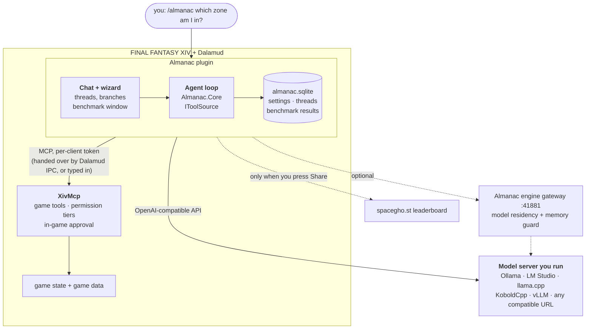

Almanac owns the conversation and tool-running loop. XivMcp owns access to the
game. [Ghostty](https://github.com/Spaceghost/ghostty-dalamud) supplies terminals;
[XivDesktop](https://github.com/Spaceghost/xivdesktop-dalamud) supplies a desktop
launcher and its own experimental dialogue/session interfaces. None is a
mandatory host for Almanac's standalone chat window. A companion's planned
adapter is not proof that it exists in the build you installed.

## Install

Two paths, both supported. The plugin repository is one click; building it yourself takes a .NET SDK and about a
minute, is the path the author develops on, and stays supported for friends and strangers who want to read the code first.

### One click (plugin repository)

Almanac is published in the author's own third-party plugin repository, next to the other FFXIV mods there.

In game:

1. `/xlsettings` → **Experimental** → **Custom Plugin Repositories** → paste

   ```
   https://spacegho.st/mods/ffxiv/plugins.json
   ```

   → **+** → **Save and close**.
2. `/xlplugins` → **All Plugins** → search **Almanac** → **Install**.

> [!NOTE]
> **Almanac has a stable release**, so it shows up without opting in to anything. To take test builds ahead of a
> release, tick **Testing** on Almanac's own entry in `/xlplugins`; that opts this one plugin in and nothing else. The other
> three mods in the repository are testing-only for now and need `/xlsettings` → **Experimental** →
> **Get plugin testing builds**.

<https://spacegho.st/mods/ffxiv/plugins/> walks through the same steps and says what every mod in the repository is. It is a
third-party repository, not the official Dalamud one: Dalamud will warn you that nobody but the author has reviewed it,
which is true.

Then start a model server on your PC and open `/almanac setup`.

For prereleases, use the plugin's **Testing** option when available. A plugin
with only test builds may require **Get plugin testing builds** in the
experimental settings before it appears. Check the
[feed installation page](https://spacegho.st/mods/ffxiv/plugins/) and the
[repository's releases](https://github.com/Spaceghost/almanac-dalamud/releases)
for the build actually offered. A feed entry is not evidence of a successful
in-game test. Dalamud's third-party warning applies.


### Build it yourself (dev plugin)

Install the .NET 10 SDK required by the checkout and matching Dalamud reference
assemblies, then:

```sh
git clone https://github.com/Spaceghost/almanac-dalamud.git
cd almanac-dalamud
dotnet build dalamud/Almanac.Dalamud.slnx -c Release
```

By default the DLL is beside the checkout, not inside it:

```text
../almanac-dalamud-build/artifacts/bin/Almanac.Plugin/release/Almanac.dll
```

[`dalamud/Directory.Build.props`](dalamud/Directory.Build.props) controls this
layout; `ALMANAC_ARTIFACTS` overrides the artifact root. Keep the entire output
folder together, including `Almanac.json` and its companion DLLs.

1. `/xlsettings` → **Experimental** → **Dev Plugin Locations**: add the full
   DLL path. Under Wine use its mapped `Z:` path; on Windows use its native path.
2. `/xlplugins` → **Dev Tools** → **Installed Dev Plugins**: enable **Almanac**
   and enable start-on-boot for subsequent sessions.
3. `/almanac setup` opens the wizard. After rebuilding, use the plugin's reload
   control in `/xlplugins`.

Installed Dalamud references are normally under
`~/.xlcore/dalamud/Hooks/dev/` on Linux or
`%APPDATA%\XIVLauncher\addon\Hooks\dev\` on Windows. On a separate build host,
use `dalamud/tools/fetch-dalamud.sh` and point `DALAMUD_HOME` at the fetched
references. `dalamud/tools/package.sh` produces the release-style package.
Recheck references after a Dalamud update; a source build does not update the
player's Dalamud installation.

## First conversation

Open `/almanac setup` and walk through the wizard:

1. **Server:** choose a detected endpoint or enter your own. Detection includes
   the usual local ports for Ollama, LM Studio, llama.cpp, KoboldCpp and vLLM.
2. **GPU and model:** check the detected VRAM, account for the game sharing that
   GPU, and install a model suggested for the remaining budget. Recommendations
   use the online list with a bundled fallback; they are not a guarantee that
   a particular model/context combination fits.
3. **Tool calling:** choose the installed model and press **Test tool calling**.
   Native tool support, prompted fallback and untested support are different
   states; a model producing fluent text does not prove it can use tools.
4. **XivMcp:** test the game connection, then finish and open chat. Automatic
   linking requires a compatible XivMcp build. Otherwise create a client token
   there and enter it under **Almanac → Settings → XivMcp**.

Begin with a plain question to check that a reply streams into the window.
Then, with XivMcp connected, ask a read-only question such as:

```text
/almanac Which zone am I in?
```

Inspect the tool result as well as the answer. A plausible sentence is not proof
that the game connection worked. These are acceptance checks to perform, not
in-game results claimed by this README. Keep XivMcp's Action and Chat tiers off
until you intentionally need them, and keep its confirmation controls enabled.

## Commands

| Command | Purpose |
| --- | --- |
| `/almanac` | Toggle the chat window. |
| `/almanac <question>` | Open chat and send a question; opens setup when the request cannot be accepted. |
| `/almanac setup` | Reopen server/model/game-link setup. |
| `/almanac new` | Start a new conversation and open chat. |
| `/almanac settings`, `/almanac config` | Open settings. |
| `/almanac bench`, `/almanac benchmark` | Open the benchmark window. |

The chat keeps threads in SQLite, supports follow-ups and branching from a
message, and offers smaller or larger tool sets. Start with fewer tools when
checking a model's reliability. Command registration and dispatch live in
[`Plugin.cs`](dalamud/src/Almanac.Plugin/Plugin.cs).

## Screens

Nothing has been captured yet, because the plugin has not been seen in a running game yet. These are the named slots
from the [minisite](https://spacegho.st/mods/ffxiv/almanac/about/)'s media manifest; a real capture replaces the placeholder of the same id
in `docs/media/` and nothing else moves.

<table>
<tr>
<td width="50%" valign="top">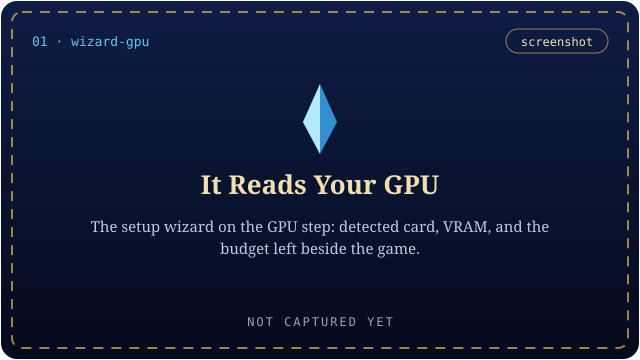<br><sub><b>It Reads Your GPU</b> · <code>wizard-gpu</code></sub></td>
<td width="50%" valign="top">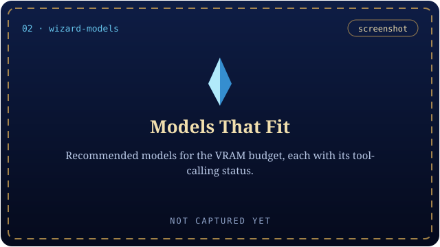<br><sub><b>Models That Fit</b> · <code>wizard-models</code></sub></td>
</tr>
<tr>
<td width="50%" valign="top">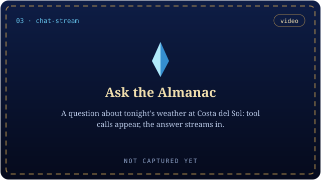<br><sub><b>Ask the Almanac</b> · <code>chat-stream</code></sub></td>
<td width="50%" valign="top">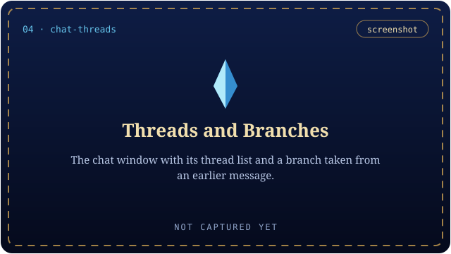<br><sub><b>Threads and Branches</b> · <code>chat-threads</code></sub></td>
</tr>
</table>

<details>
<summary><b>The other 3 planned shots</b></summary>
<br>

<table>
<tr>
<td width="50%" valign="top">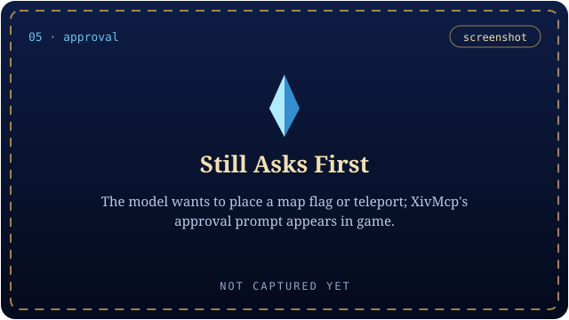<br><sub><b>Still Asks First</b> · <code>approval</code></sub></td>
<td width="50%" valign="top">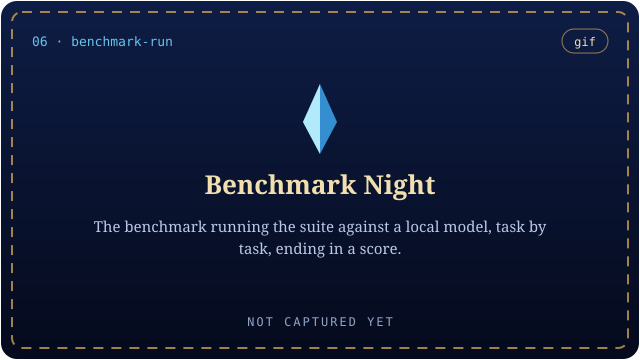<br><sub><b>Benchmark Night</b> · <code>benchmark-run</code></sub></td>
</tr>
<tr>
<td width="50%" valign="top">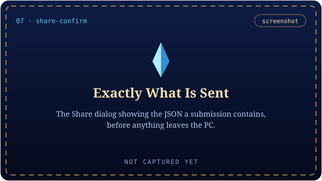<br><sub><b>Exactly What Is Sent</b> · <code>share-confirm</code></sub></td>
<td width="50%"></td>
</tr>
</table>

</details>

## What is verified

● yes &nbsp;·&nbsp; ◐ partly &nbsp;·&nbsp; ○ no &nbsp;·&nbsp; — does not apply. **Seen in game** means observed on that build in a running game; a passing host test never earns it.

**The plugin**

| Area | Built | Host tests | Seen in game | Notes |
| --- | :---: | :---: | :---: | --- |
| Core logic: model client, MCP client, agent loop, scorer against the shared vectors, setup detection, SQLite store | ● | ● | ○ | `dalamud/tests/Almanac.Core.Tests`, with fakes; no game and no network |
| The plugin in a running game: the windows, the chat, the wizard | ● | ○ | ○ | never observed |
| DXGI GPU detection (Windows and Wine/DXVK) | ● | ○ | ○ | unverified on both |
| The SQLite native library inside Dalamud | ● | ○ | ○ | the store is tested on the host only |
| XivMcp link: IPC token handover, live tools | ● | ◐ | ○ | MCP client tested with fakes; depends on a compatible XivMcp build |
| Benchmark, mock tools | ● | ● | ○ | both clients are tested against the same scoring vectors |
| Benchmark, live through XivMcp | ● | ○ | ○ | untested |
| Sign-in and **Share** | ● | ◐ | ○ | tested with a fake server, not a live game or the live leaderboard |

**The engine** (no game involved, so the last column is *Run for real*)

| Area | Built | Tests | Run for real | Notes |
| --- | :---: | :---: | :---: | --- |
| MCP server, read tools | ● | ● | ● | Claude Code and Codex were tested calling read tools |
| MCP elicitation (confirming change tools) | ● | ● | ○ | tested with the MCP SDK's client only, not a real interactive client |
| `claude mcp add` with the `${ALMANAC_TOKEN}` header | ● | — | ◐ | the same header in a `--mcp-config` file was tested; `claude mcp add` was not |
| `almanac local` / `ai` | ● | ● | ◐ | `status`, `ask` and one-shot `code -p` ran against two real backends (gateways in front of Ollama); interactive Codex only seen to start; `ai chat`, `ollama`/`openai` kinds, a second machine and the `inflight` signal are fakes only |
| `almanac bench` against a real model server, and `--live` | ● | ● | ○ | mock tools only |
| The leaderboard API (`/mods/ffxiv/almanac/api/results`) | ● | — | ○ | untested |
| `deploy/quadlet`, `deploy/incus` | ● | — | ○ | not run on real hardware |
| Embeddings (`[kb] embed_model`) | ● | — | ○ | no real embedding model |
| Screenshot helper | ● | — | ◐ | GNOME only |
| Autopilot | ● | ● | ○ | fakes and dry-run against a scratch git repository; no real `claude -p`, `codex exec`, aider, `gh pr create`, push, XivMcp ticket or remote backend |

The full list, in the author's words, is the **Untested** section of [GUIDE.md](GUIDE.md#untested); the tables above add
nothing to it. The [changelog](CHANGELOG.md) keeps an entry at **BETA** until it has been seen working where it has to run.

<details>
<summary><b>Untested, in full</b> — copied from GUIDE.md</summary>
<br>

- MCP elicitation with a real interactive client (tested with the MCP SDK's
  client only; Claude Code and Codex were tested calling read tools).
- `claude mcp add` with the `${ALMANAC_TOKEN}` header (the same header in a
  `--mcp-config` file was tested).
- `deploy/quadlet` and `deploy/incus` on real hardware.
- Embeddings (`[kb] embed_model`) against a real embedding model.
- The screenshot helper on desktops other than GNOME.
- The Almanac plugin in a running game: the windows, DXGI GPU detection
  (Windows and Wine/DXVK), the SQLite native library inside Dalamud, the XivMcp
  IPC connection and live benchmark mode. Its Core logic is unit-tested with
  fakes; nothing has been run against a real model server or in game yet.
- `almanac bench` against a real model server and live XivMcp.
- The leaderboard API itself (`/mods/ffxiv/almanac/api/results`).
- Autopilot has only run against fakes and in dry-run against a scratch git
  repository: no real `claude -p`, `codex exec`, aider, `gh pr create`, push,
  XivMcp approval ticket or remote model backend has been exercised. The
  ticket tools (`request_action`, `get_ticket`) follow the interface XivMcp
  is adding on its deferred-approvals branch; argument names are read from the
  tool's schema, but the result shape is assumed (`ticket_id`/`id`,
  `state`/`status`, `result`). No quest-tracker objective tool exists in
  XivMcp yet, so that path is feature-detected and untested. The bubblewrap
  profile has not been run with the real coding CLIs.
- `almanac local` / `ai`: `status`, `ask` and one-shot `code -p` were run
  against two real backends (almanac gateways in front of Ollama). The
  interactive Codex session was only seen to start, not used for a typed turn;
  `ai chat` was not driven by a person; `kind = "ollama"` and `kind = "openai"`
  backends, a second machine (laptop) and the gateway's `inflight` busy signal
  on a deployed gateway are tested with fakes only. `ai claude` rests on four
  tiny tasks (see "Claude Code on the local model").

</details>

## Permissions and privacy

**A local model is a deployment choice, not a promise about every endpoint.**
Almanac sends the conversation and selected tool context to the model server
you configure. A remote or cloud-backed endpoint changes where that data goes.
Game/chat data included in tool results may therefore reach that endpoint too.
Review its address and your tool selection before discussing private material.

XivMcp enforces game-tool permissions and approval. Almanac's agent does not
replace that gate. Automatic token/model handoff depends on compatible IPC;
do not assume a branch name mentioned in older notes is a released feature.
Enter tokens in settings when needed, not in screenshots, issue reports or
committed configuration.

The plugin opens `almanac.sqlite` in the configuration directory supplied by
Dalamud. It contains settings, conversations and benchmark state; treat it as
private. Unload the plugin before taking a simple file-copy backup, and do
not upload the database as a diagnostic attachment.

The optional engine has its own configuration, tokens, audit records and thread
storage. Its coding integrations can use cloud clients and execute commands.
Read [the engine guide](GUIDE.md) before enabling those; installing the plugin
alone does not enable the engine or its autonomous coding loop.

## Community benchmark

The shared suite and scoring contract live in [`benchmark/`](benchmark/),
with [scoring rules](benchmark/README.md) and
[common test vectors](benchmark/testdata/scoring-vectors.json).

| Mode | What it establishes |
| --- | --- |
| In-game mock benchmark | Model/tool behavior against the supplied test data, not a live game integration. |
| In-game live benchmark | Uses the configured XivMcp connection; permissions and actual game state still matter. |
| Headless `almanac bench` | Engine-side evaluation; default mock tools do not require the game. `--live` uses XivMcp. |

Results stay local until you choose **Share** and confirm the JSON. Sharing
uses a browser sign-in/device-code flow. The submitted result describes hardware,
model/configuration and scores rather than player names or local paths, but
**the server can associate a submission with the signed-in account**. That is
not anonymous submission. Review the payload before approving it.

Scores include tool validity/success, task-answer checks and performance
measurements. Compare the same suite version and relevant model/context settings;
a single result is not a universal model recommendation.

The leaderboard is at <https://spacegho.st/mods/ffxiv/almanac/>; the plugin's own page is <https://spacegho.st/mods/ffxiv/almanac/about/>.

## Optional headless engine

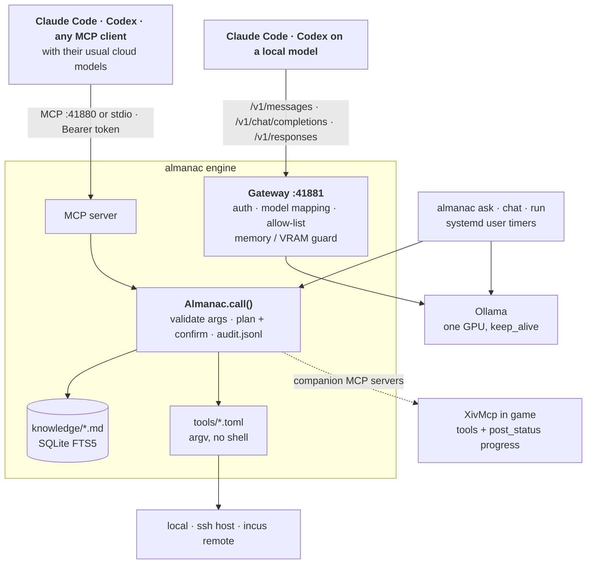

The Python engine is useful outside the game: search Markdown notes, expose
declared tools over MCP, run a local chat, route coding clients to selected
models, or manage an opt-in coding-task queue. Full deployment, gateway,
residency, backend-pool, thread and approval details are in **[GUIDE.md](GUIDE.md)**.
The former long-form README is preserved there, in the repository root, so its
relative file links retain their meaning.

The supplied service installation uses **Linux, Python 3.11+ with SQLite FTS5,
and systemd user services**. From the checkout:

```sh
deploy/install.sh
almanac doctor
almanac tools
```

The rootless installer creates the engine's configuration/token, virtual
environment and user services and starts the MCP server and gateway. Inspect
[`config.example.toml`](config.example.toml) before exposing either listener
beyond loopback. This is a separate installation from the Dalamud plugin.

| Interface | Entry point |
| --- | --- |
| Local conversation | `almanac ask "question"`, `almanac chat` |
| Knowledge and declared tools | `almanac search ...`, `almanac tools`, `almanac audit` |
| MCP server | Default port `41880`; configured bearer-token authentication. |
| Model gateway | Default port `41881`; an optional plugin endpoint is `http://127.0.0.1:41881/v1`. |
| Local coding/backends | `ai` / `almanac local`; see the full guide for isolation, limits and cloud-client differences. |

Autopilot is a separate opt-in workflow, dry-run by default. Review its allowed
repositories, approval scopes, worktrees, sandbox behavior and cloud budgets
before enabling live work. A local model does not make shell execution harmless.

### When Claude runs out

`ai` (also `almanac local`) shows which of your own GPUs are free and starts a coding or chat session on one when the
cloud runs out. Backends, the opt-in Claude Code path and what was and was not tested:
[GUIDE.md, "When Claude runs out"](GUIDE.md#when-claude-runs-out).

### Autopilot

An opt-in, dry-run-by-default loop that plans with the local model pool and runs coding sessions in sandboxed
worktrees. How a task runs, the model pool, approval, the safety model, costs and caps, and how to enable it:
[GUIDE.md, "Autopilot"](GUIDE.md#autopilot). It has only run against fakes and in dry-run.

| In the guide | |
| --- | --- |
| [Architecture](GUIDE.md#architecture) · [Install](GUIDE.md#install) · [Using it](GUIDE.md#using-it) | the engine, end to end |
| [Connect Claude Code](GUIDE.md#connect-claude-code) · [Connect Codex](GUIDE.md#connect-codex) | MCP, and running either on the local model |
| [Adding knowledge](GUIDE.md#adding-knowledge) · [Adding a tool](GUIDE.md#adding-a-tool) · [docs/TOOLS.md](docs/TOOLS.md) | Markdown notes and one-file TOML tools |
| [Security model](GUIDE.md#security-model) · [Model residency](GUIDE.md#model-residency) | confirmation, audit, and keeping inference off a busy GPU |
| [FFXIV and Dalamud (engine)](GUIDE.md#ffxiv-and-dalamud-engine) | Dalamud log and dev-build tools, XivMcp as a companion |


## Troubleshooting

| Symptom | Check first |
| --- | --- |
| `/almanac` is unknown | Check the plugin location and enabled state in `/xlplugins`, then inspect the Dalamud log for `Almanac`. |
| No model or a connection error | Confirm the server is running, the endpoint is reachable from the game and the selected model is installed. Re-run setup's server test. |
| Text works but tools do not | Run **Test tool calling**, try a smaller tool set, then test the XivMcp connection separately. |
| Automatic game linking fails | Check the installed XivMcp build; configure an explicit client token instead of assuming newer IPC is present. |
| An action is denied or waiting | Inspect XivMcp permissions and its approval UI. Do not disable confirmations just to hide the symptom. |
| Benchmark sharing requests sign-in again | Complete the displayed sign-in flow; a rejected/expired token is not repaired by posting it in an issue. Live sharing still needs end-to-end validation. |
| Build fails on references or dependency audit | Check the required SDK/reference paths and the actual warning/error. Do not suppress the audit to turn an unsafe build green. |

Report the exact commit/build, OS, Dalamud version, model/backend/context,
reproduction steps and a redacted error. Never attach bearer tokens, the chat
database or an unreviewed conversation transcript.

## Development and integration

Run the plugin's non-UI tests without a game or model server:

```sh
dotnet test dalamud/tests/Almanac.Core.Tests
```

They cover such areas as model/MCP clients, agent logic, setup detection,
SQLite storage and scoring. Record actual results for the tested commit;
these tests do not certify rendering, Wine behavior or live submissions.

| Integration point | Contract |
| --- | --- |
| `Almanac.ApiVersion` | `Func<int>`; the current plugin registers API version 1. |
| `Almanac.Ask` | `Func<string, bool>`; opens chat and requests a turn. The boolean means accepted, **not** an answer or completed action; a request may be rejected when not ready/busy. |
| `IToolSource` | Game tools and benchmark mocks feed the agent through this abstraction. Sandboxed WebAssembly sources are a proposed extension, not a shipped capability. |

See [the detailed guide](GUIDE.md), [declared tool format](docs/TOOLS.md),
[benchmark contract](benchmark/README.md) and [changelog](CHANGELOG.md).
Keep documentation tied to the source/build it describes; separate host-test
evidence from observations made inside the game.

<details>
<summary><a name="changelog"></a><b>Changelog convention</b> — one source, `changelog.json`; what SOON, BETA and NEW mean</summary>
<br>

`changelog.json` at the top of the repository is the changelog. It is the
single source of truth for both places a user reads it:

- **In game** — the plugin embeds it (`Almanac.Core.Changelog`) and the
  Settings window shows it under **What's new**.
- **[CHANGELOG.md](CHANGELOG.md)** — generated from it:

  ```sh
  tools/changelog.py           # rewrite CHANGELOG.md from changelog.json
  tools/changelog.py --check   # what CI runs: fails, with a diff, on drift
  ```

The convention, and it is not optional: **every change a user can see adds or
edits its entry in `changelog.json` in the same commit as the change**, and
regenerates `CHANGELOG.md`. Never edit `CHANGELOG.md` by hand. CI runs the
check on every push, and `tests/test_changelog.py` runs it under pytest.

A status word means exactly the same thing here as it does in Ghostty for
FFXIV's changelog, and nothing more:

| Status | Shown | Means |
| --- | --- | --- |
| `next` | SOON | still being built; not merged. |
| `beta` | BETA | merged, but **not yet verified** where it has to run — in game, or against a real model server. |
| `new` / `fix` | NEW / FIX | in a numbered release: seen working. |

An entry keeps its `beta` until the thing it describes has actually been
observed working; say what is unverified in the entry itself, the way
"Untested" below does, rather than writing around it.

</details>

## The family

Four mods, one plugin repository, one look. They work alone and better together.

<table>
<tr>
<td width="96" align="center"><a href="https://github.com/Spaceghost/ghostty-dalamud">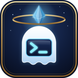</a></td>
<td valign="top"><b><a href="https://github.com/Spaceghost/ghostty-dalamud">Ghostty for FFXIV</a></b><br>A real terminal in the game: a glass dropdown, tabs, and screens you pin in the world.<br><sub><a href="https://spacegho.st/mods/ffxiv/term/">minisite</a> · <a href="https://github.com/Spaceghost/ghostty-dalamud"><code>Spaceghost/ghostty-dalamud</code></a></sub></td>
</tr>
<tr>
<td width="96" align="center"><a href="https://github.com/Spaceghost/xivmcp-dalamud">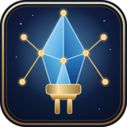</a></td>
<td valign="top"><b><a href="https://github.com/Spaceghost/xivmcp-dalamud">XivMcp</a></b><br>An MCP server inside the game, so your own AI client can read it and, with your approval, act.<br><sub><a href="https://spacegho.st/mods/ffxiv/xivmcp/">minisite</a> · <a href="https://github.com/Spaceghost/xivmcp-dalamud"><code>Spaceghost/xivmcp-dalamud</code></a></sub></td>
</tr>
<tr>
<td width="96" align="center"><a href="https://github.com/Spaceghost/xivdesktop-dalamud"></a></td>
<td valign="top"><b><a href="https://github.com/Spaceghost/xivdesktop-dalamud">XivDesktop</a></b><br>A launcher, workspaces and a taskbar for Linux desktop apps shown as panels in the world.<br><sub><a href="https://spacegho.st/mods/ffxiv/xivdesktop/">minisite</a> · <a href="https://github.com/Spaceghost/xivdesktop-dalamud"><code>Spaceghost/xivdesktop-dalamud</code></a></sub></td>
</tr>
<tr>
<td width="96" align="center"><a href="https://github.com/Spaceghost/almanac-dalamud"></a></td>
<td valign="top"><b><a href="https://github.com/Spaceghost/almanac-dalamud">Almanac</a></b> &nbsp;<sub>(you are here)</sub><br>A model on your own GPU, in game chat, with XivMcp's tools and a community benchmark.<br><sub><a href="https://spacegho.st/mods/ffxiv/almanac/about/">minisite</a> · <a href="https://github.com/Spaceghost/almanac-dalamud"><code>Spaceghost/almanac-dalamud</code></a></sub></td>
</tr>
</table>

## License and support

Maintained by [Spaceghost](https://github.com/Spaceghost), under the
[MIT license](LICENSE). Report reproducible problems in
[issues](https://github.com/Spaceghost/almanac-dalamud/issues).
This is an independent third-party project; successful packaging does not
establish official Dalamud-list approval.

<p align="center"></p>

<p align="center">
  <a href="https://spacegho.st/mods/ffxiv/">All mods</a> &nbsp;·&nbsp;
  <a href="https://spacegho.st/mods/ffxiv/almanac/about/">Almanac minisite</a> &nbsp;·&nbsp;
  <a href="https://spacegho.st/mods/ffxiv/plugins/">Plugin repository</a> &nbsp;·&nbsp;
  <a href="https://spacegho.st/mods/ffxiv/term/vote/">Vote on features</a> &nbsp;·&nbsp;
  <a href="https://spacegho.st/mods/ffxiv/term/gallery/">Gallery</a> &nbsp;·&nbsp;
  <a href="https://spacegho.st/mods/ffxiv/almanac/">Model leaderboard</a> &nbsp;·&nbsp;
  <a href="https://github.com/Spaceghost/almanac-dalamud/blob/master/CHANGELOG.md">Changelog</a>
</p>

<p align="center"><sub>Made by <b>Johnneylee Jack Rollins</b> · <a href="https://github.com/Spaceghost">github.com/Spaceghost</a><br>
FINAL FANTASY XIV © SQUARE ENIX CO., LTD. These are independent fan projects, not affiliated with or endorsed by Square Enix, Dalamud or XIVLauncher.</sub></p>

