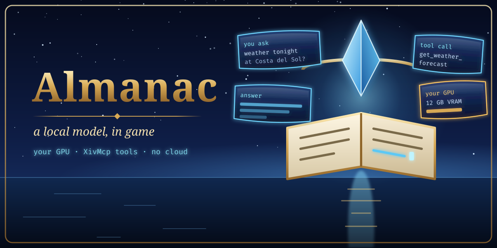
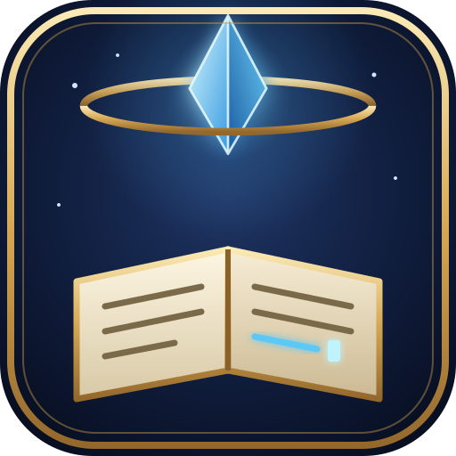

# Almanac

<p align="center">
  <picture>
    <source media="(prefers-color-scheme: dark)" srcset="images/readme/hero-dark.png">
    <source media="(prefers-color-scheme: light)" srcset="images/readme/hero-light.png">
    
  </picture>
</p>



**[Site](https://spacegho.st/mods/ffxiv/almanac/about/) · [Model leaderboard](https://spacegho.st/mods/ffxiv/almanac/) · [Install](https://spacegho.st/mods/ffxiv/plugins/) · [Vote on what's next](https://spacegho.st/mods/ffxiv/almanac/vote/) · [Screenshots](https://spacegho.st/mods/ffxiv/term/gallery/?mod=almanac) · [Changelog](CHANGELOG.md)**

**Local-model chat for FINAL FANTASY XIV, with game tools you control.**

Almanac is a Dalamud plugin that connects a model server to an in-game chat:
streaming replies, persistent conversation threads, a setup wizard and a
shared model benchmark. [XivMcp](https://github.com/Spaceghost/xivmcp-dalamud)
provides the game tools and enforces their permissions.

This repository also contains the **optional Python Almanac engine**: a
headless knowledge/tool runner, MCP server, model gateway and coding-task
orchestrator. **Players do not need Python, systemd, the gateway, or the engine
to use the C# plugin.** They do need a model server; the plugin does not bundle
or run the model itself.

> **Status: developer preview.** The plugin targets Dalamud API 15 / .NET 10.
> Host-side tests cover non-UI logic; they do not establish in-game rendering,
> end-to-end companion compatibility or a live benchmark submission. The
> current sign-in/sharing work was tested with a fake server, not a live game
> or leaderboard. Do not read installation instructions as a compatibility
> certification or official Dalamud-list approval.

[Install the plugin](#install-the-plugin) · [First conversation](#first-conversation) ·
[Commands](#commands) · [Privacy](#permissions-and-privacy) ·
[Optional engine](#optional-headless-engine) · [Full guide](GUIDE.md)

## Choose your path

| You want to… | Start here |
| --- | --- |
| Chat with your own model while playing | Install **Almanac**, start a model server, then run `/almanac setup`. |
| Let that model read game state or request actions | Also install **XivMcp** and test the connection. Keep action/chat permissions off while setting up. |
| Build or change the Dalamud plugin | Use the [.NET source build](#build-the-plugin-from-source); no Python engine is needed. |
| Serve notes/tools to coding clients or manage several model machines | Use the [optional engine](#optional-headless-engine) and [detailed guide](GUIDE.md). |

## How it fits together

```text
In FINAL FANTASY XIV
  /almanac --> C# plugin --> model server you configured
                  |          Ollama / LM Studio / llama.cpp / compatible API
                  |
                  +--> XivMcp --> permitted game tools
                  |               action/chat approval stays with XivMcp
                  `--> local SQLite: settings, threads, benchmark results

Optional, outside the game
  almanac engine --> Markdown knowledge + declared tools + local agent loop
       |--> MCP :41880                 coding clients can use its tools
       `--> gateway :41881             model routing and memory/residency guard
```

Almanac owns the conversation and tool-running loop. XivMcp owns access to the
game. [Ghostty](https://github.com/Spaceghost/ghostty-dalamud) supplies terminals;
[XivDesktop](https://github.com/Spaceghost/xivdesktop-dalamud) supplies a desktop
launcher and its own experimental dialogue/session interfaces. None is a
mandatory host for Almanac's standalone chat window. A companion's planned
adapter is not proof that it exists in the build you installed.

## Install the plugin

Use the author's **third-party** plugin feed, not the official Dalamud list:

```text
https://spacegho.st/mods/ffxiv/plugins.json
```

1. `/xlsettings` → **Experimental** → **Custom Plugin Repositories**: add the
   URL, click **+**, then save and close.
2. `/xlplugins` → **All Plugins**: search **Almanac** and install it.
3. Start a model server on your PC, then open `/almanac setup`.

For prereleases, use the plugin's **Testing** option when available. A plugin
with only test builds may require **Get plugin testing builds** in the
experimental settings before it appears. Check the
[feed installation page](https://spacegho.st/mods/ffxiv/plugins/) and the
[repository's releases](https://github.com/Spaceghost/almanac-dalamud/releases)
for the build actually offered. A feed entry is not evidence of a successful
in-game test. Dalamud's third-party warning applies.

### Build the plugin from source

Install the .NET 10 SDK required by the checkout and matching Dalamud reference
assemblies, then:

```sh
git clone https://github.com/Spaceghost/almanac-dalamud.git
cd almanac-dalamud
dotnet build dalamud/Almanac.Dalamud.slnx -c Release
```

By default the DLL is beside the checkout, not inside it:

```text
../almanac-dalamud-build/artifacts/bin/Almanac.Plugin/release/Almanac.dll
```

[`dalamud/Directory.Build.props`](dalamud/Directory.Build.props) controls this
layout; `ALMANAC_ARTIFACTS` overrides the artifact root. Keep the entire output
folder together, including `Almanac.json` and its companion DLLs.

1. `/xlsettings` → **Experimental** → **Dev Plugin Locations**: add the full
   DLL path. Under Wine use its mapped `Z:` path; on Windows use its native path.
2. `/xlplugins` → **Dev Tools** → **Installed Dev Plugins**: enable **Almanac**
   and enable start-on-boot for subsequent sessions.
3. `/almanac setup` opens the wizard. After rebuilding, use the plugin's reload
   control in `/xlplugins`.

Installed Dalamud references are normally under
`~/.xlcore/dalamud/Hooks/dev/` on Linux or
`%APPDATA%\XIVLauncher\addon\Hooks\dev\` on Windows. On a separate build host,
use `dalamud/tools/fetch-dalamud.sh` and point `DALAMUD_HOME` at the fetched
references. `dalamud/tools/package.sh` produces the release-style package.
Recheck references after a Dalamud update; a source build does not update the
player's Dalamud installation.

## First conversation

Open `/almanac setup` and walk through the wizard:

1. **Server:** choose a detected endpoint or enter your own. Detection includes
   the usual local ports for Ollama, LM Studio, llama.cpp, KoboldCpp and vLLM.
2. **GPU and model:** check the detected VRAM, account for the game sharing that
   GPU, and install a model suggested for the remaining budget. Recommendations
   use the online list with a bundled fallback; they are not a guarantee that
   a particular model/context combination fits.
3. **Tool calling:** choose the installed model and press **Test tool calling**.
   Native tool support, prompted fallback and untested support are different
   states; a model producing fluent text does not prove it can use tools.
4. **XivMcp:** test the game connection, then finish and open chat. Automatic
   linking requires a compatible XivMcp build. Otherwise create a client token
   there and enter it under **Almanac → Settings → XivMcp**.

Begin with a plain question to check that a reply streams into the window.
Then, with XivMcp connected, ask a read-only question such as:

```text
/almanac Which zone am I in?
```

Inspect the tool result as well as the answer. A plausible sentence is not proof
that the game connection worked. These are acceptance checks to perform, not
in-game results claimed by this README. Keep XivMcp's Action and Chat tiers off
until you intentionally need them, and keep its confirmation controls enabled.

## Commands

| Command | Purpose |
| --- | --- |
| `/almanac` | Toggle the chat window. |
| `/almanac <question>` | Open chat and send a question; opens setup when the request cannot be accepted. |
| `/almanac setup` | Reopen server/model/game-link setup. |
| `/almanac new` | Start a new conversation and open chat. |
| `/almanac settings`, `/almanac config` | Open settings. |
| `/almanac bench`, `/almanac benchmark` | Open the benchmark window. |

The chat keeps threads in SQLite, supports follow-ups and branching from a
message, and offers smaller or larger tool sets. Start with fewer tools when
checking a model's reliability. Command registration and dispatch live in
[`Plugin.cs`](dalamud/src/Almanac.Plugin/Plugin.cs).

## Permissions and privacy

**A local model is a deployment choice, not a promise about every endpoint.**
Almanac sends the conversation and selected tool context to the model server
you configure. A remote or cloud-backed endpoint changes where that data goes.
Game/chat data included in tool results may therefore reach that endpoint too.
Review its address and your tool selection before discussing private material.

XivMcp enforces game-tool permissions and approval. Almanac's agent does not
replace that gate. Automatic token/model handoff depends on compatible IPC;
do not assume a branch name mentioned in older notes is a released feature.
Enter tokens in settings when needed, not in screenshots, issue reports or
committed configuration.

The plugin opens `almanac.sqlite` in the configuration directory supplied by
Dalamud. It contains settings, conversations and benchmark state; treat it as
private. Unload the plugin before taking a simple file-copy backup, and do
not upload the database as a diagnostic attachment.

The optional engine has its own configuration, tokens, audit records and thread
storage. Its coding integrations can use cloud clients and execute commands.
Read [the engine guide](GUIDE.md) before enabling those; installing the plugin
alone does not enable the engine or its autonomous coding loop.

## Community benchmark

The shared suite and scoring contract live in [`benchmark/`](benchmark/),
with [scoring rules](benchmark/README.md) and
[common test vectors](benchmark/testdata/scoring-vectors.json).

| Mode | What it establishes |
| --- | --- |
| In-game mock benchmark | Model/tool behavior against the supplied test data, not a live game integration. |
| In-game live benchmark | Uses the configured XivMcp connection; permissions and actual game state still matter. |
| Headless `almanac bench` | Engine-side evaluation; default mock tools do not require the game. `--live` uses XivMcp. |

Results stay local until you choose **Share** and confirm the JSON. Sharing
uses a browser sign-in/device-code flow. The submitted result describes hardware,
model/configuration and scores rather than player names or local paths, but
**the server can associate a submission with the signed-in account**. That is
not anonymous submission. Review the payload before approving it.

Scores include tool validity/success, task-answer checks and performance
measurements. Compare the same suite version and relevant model/context settings;
a single result is not a universal model recommendation.

## Optional headless engine

The Python engine is useful outside the game: search Markdown notes, expose
declared tools over MCP, run a local chat, route coding clients to selected
models, or manage an opt-in coding-task queue. Full deployment, gateway,
residency, backend-pool, thread and approval details are in **[GUIDE.md](GUIDE.md)**.
The former long-form README is preserved there, in the repository root, so its
relative file links retain their meaning.

The supplied service installation uses **Linux, Python 3.11+ with SQLite FTS5,
and systemd user services**. From the checkout:

```sh
deploy/install.sh
almanac doctor
almanac tools
```

The rootless installer creates the engine's configuration/token, virtual
environment and user services and starts the MCP server and gateway. Inspect
[`config.example.toml`](config.example.toml) before exposing either listener
beyond loopback. This is a separate installation from the Dalamud plugin.

| Interface | Entry point |
| --- | --- |
| Local conversation | `almanac ask "question"`, `almanac chat` |
| Knowledge and declared tools | `almanac search ...`, `almanac tools`, `almanac audit` |
| MCP server | Default port `41880`; configured bearer-token authentication. |
| Model gateway | Default port `41881`; an optional plugin endpoint is `http://127.0.0.1:41881/v1`. |
| Local coding/backends | `ai` / `almanac local`; see the full guide for isolation, limits and cloud-client differences. |

Autopilot is a separate opt-in workflow, dry-run by default. Review its allowed
repositories, approval scopes, worktrees, sandbox behavior and cloud budgets
before enabling live work. A local model does not make shell execution harmless.

## Troubleshooting

| Symptom | Check first |
| --- | --- |
| `/almanac` is unknown | Check the plugin location and enabled state in `/xlplugins`, then inspect the Dalamud log for `Almanac`. |
| No model or a connection error | Confirm the server is running, the endpoint is reachable from the game and the selected model is installed. Re-run setup's server test. |
| Text works but tools do not | Run **Test tool calling**, try a smaller tool set, then test the XivMcp connection separately. |
| Automatic game linking fails | Check the installed XivMcp build; configure an explicit client token instead of assuming newer IPC is present. |
| An action is denied or waiting | Inspect XivMcp permissions and its approval UI. Do not disable confirmations just to hide the symptom. |
| Benchmark sharing requests sign-in again | Complete the displayed sign-in flow; a rejected/expired token is not repaired by posting it in an issue. Live sharing still needs end-to-end validation. |
| Build fails on references or dependency audit | Check the required SDK/reference paths and the actual warning/error. Do not suppress the audit to turn an unsafe build green. |

Report the exact commit/build, OS, Dalamud version, model/backend/context,
reproduction steps and a redacted error. Never attach bearer tokens, the chat
database or an unreviewed conversation transcript.

## Development and integration

Run the plugin's non-UI tests without a game or model server:

```sh
dotnet test dalamud/tests/Almanac.Core.Tests
```

They cover such areas as model/MCP clients, agent logic, setup detection,
SQLite storage and scoring. Record actual results for the tested commit;
these tests do not certify rendering, Wine behavior or live submissions.

| Integration point | Contract |
| --- | --- |
| `Almanac.ApiVersion` | `Func<int>`; the current plugin registers API version 1. |
| `Almanac.Ask` | `Func<string, bool>`; opens chat and requests a turn. The boolean means accepted, **not** an answer or completed action; a request may be rejected when not ready/busy. |
| `IToolSource` | Game tools and benchmark mocks feed the agent through this abstraction. Sandboxed WebAssembly sources are a proposed extension, not a shipped capability. |

See [the detailed guide](GUIDE.md), [declared tool format](docs/TOOLS.md),
[benchmark contract](benchmark/README.md) and [changelog](CHANGELOG.md).
Keep documentation tied to the source/build it describes; separate host-test
evidence from observations made inside the game.

## Releasing

```sh
tools/release.sh test            # the next testing build, from master as it is
tools/release.sh stable X.Y.Z    # the stable release X.Y.Z
```

One command: it checks the tree and CI, writes the version everywhere it lives, dates
the changelog, tags, pushes, waits for the Release workflow, and verifies the published
files and the live listing. `-n` is a dry run. See [docs/RELEASING.md](docs/RELEASING.md).

## License and support

Maintained by [Spaceghost](https://github.com/Spaceghost), under the
[MIT license](LICENSE). Report reproducible problems in
[issues](https://github.com/Spaceghost/almanac-dalamud/issues).
This is an independent third-party project; successful packaging does not
establish official Dalamud-list approval.
